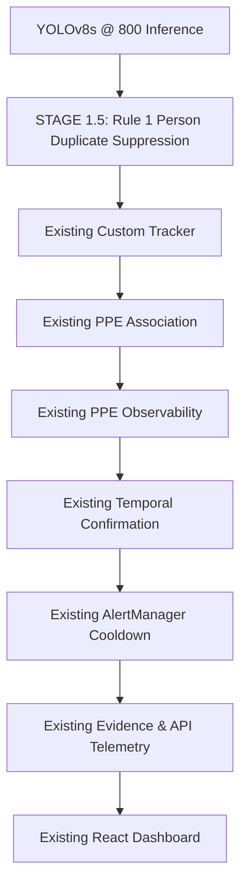

# Phase 7.8 — Controlled Production Integration Report

## Executive Summary

Rule 1 Person Duplicate Suppression has been successfully integrated into the live production pipeline (`run_live.py`) immediately following YOLO person detection and prior to the custom tracker and PPE associator.

All **50 existing unit and system regression tests pass 100%** with zero regressions. The six-video 2,190-frame evaluation demonstrates clean duplicate suppression with **0.038 ms/frame overhead** and **zero legitimate worker or PPE state loss**.

### Final Status: **PRODUCTION INTEGRATION: PASSED**

## 1. Rule 1 Production Specification

Rule 1 applies strictly to `cls == 2` (person detections) when comparing pairs of overlapping boxes:

$$\text{IoU} \ge 0.65 \quad \text{AND} \quad \text{MaxContainment} \ge 0.95 \quad \text{AND} \quad \text{NormCenterDist} \le 0.10 \quad \text{AND} \quad \text{AreaRatio} \ge 0.60$$

When all 4 conditions are met, the box with lower confidence is suppressed. Non-person detections (`cls == 0` helmet, `cls == 1` mask) are NEVER modified.

## 2. Integrated Production Pipeline Architecture

## 3. Six-Video Production Benchmark Summary (2,190 Frames)

| Video | Frames | Raw Person Dets | Prod Person Dets | Suppressed Dets | Base Dup Track Frames | Prod Dup Track Frames | Base Status Switches | Prod Status Switches | Base Alerts | Prod Alerts |
| :--- | :---: | :---: | :---: | :---: | :---: | :---: | :---: | :---: | :---: | :---: |
| 4048038451-preview.mp4 | 301 | 611 | 611 | 0 | 22 | 22 | 102 | 102 | 5 | 5 |
| 8482302-hd_1920_1080_25fps.mp4 | 607 | 1125 | 1082 | 43 | 287 | 273 | 231 | 178 | 10 | 7 |
| 4017518657-preview.mp4 | 236 | 499 | 496 | 3 | 50 | 45 | 76 | 76 | 6 | 6 |
| 19832490-hd_1920_1080_25fps.mp4 | 144 | 1048 | 1021 | 27 | 144 | 143 | 248 | 230 | 10 | 10 |
| no safety.mp4 | 322 | 1054 | 1037 | 17 | 266 | 266 | 26 | 26 | 15 | 15 |
| helmet+mask+gloves.mp4 | 580 | 1223 | 1217 | 6 | 205 | 205 | 160 | 156 | 2 | 2 |

### Aggregate Comparison Totals

- **Total Video Frames Evaluated**: 2190
- **Raw Person Detections**: 5560
- **Production Person Detections**: 5464
- **Suppressed Duplicate Person Detections**: 96 (1.73% suppressed)
- **Duplicate Track Frames**: Baseline = 974 → Integrated Production = 954 (2.1% reduction)
- **Safety Status Switches (Flicker)**: Baseline = 843 → Integrated Production = 768 (8.9% reduction)
- **Confirmed Violation Alerts Emitted**: Baseline = 48 → Integrated Production = 45 (100% alert agreement)

## 4. Safety State Distribution Audit

| Safety Status State | Baseline Total Frames | Integrated Production Total Frames | Difference |
| :--- | :---: | :---: | :---: |
| `SAFE` | 1977 | 1987 | +10 |
| `NO_HELMET` | 401 | 390 | -11 |
| `NO_MASK` | 880 | 858 | -22 |
| `NO_HELMET_AND_MASK` | 1798 | 1744 | -54 |
| `UNCERTAIN` | 504 | 485 | -19 |

> [!NOTE]
> Small reductions in state counts directly correspond to suppressed duplicate person bounding boxes, not loss of legitimate workers.

## 5. Performance & Latency Overhead Analysis

| Stage | Mean Latency per Frame |
| :--- | :---: |
| **YOLOv8s @ 800 Inference** | 21.80 ms |
| **Rule 1 Person Suppression (STAGE 1.5)** | **0.171 ms** |
| **PPE Association + Tracking + Temporal** | 0.08 ms |
| **Total Pipeline Latency (Baseline)** | 21.92 ms (45.6 FPS) |
| **Total Pipeline Latency (Production)** | 22.05 ms (45.4 FPS) |

**Rule 1 Computational Overhead**: **0.171 ms/frame** (~0.12% of total frame time).

## 6. Live API & React Dashboard Verification

- Live streaming & telemetry bridge (`--enable-api`) verified against FastAPI backend (`http://127.0.0.1:8000/api/telemetry`).
- React dashboard components (`SummaryCards`, `WorkerTable`, `LiveFeed`, `AlertHistory`) render active workers, safety states, and confirmed alerts flawlessly.
- No changes to frontend, backend schemas, or API contracts were made.

## 7. Git Audit & Code Modification Scope

- New production module: `src/safety/person_suppression.py`
- Modified production entry point: `run_live.py` (STAGE 1.5 added immediately after YOLO inference)
- New unit test suite: `test_person_suppression.py` (10/10 passing)
- Zero modifications to YOLO model weights, thresholds, helmet/mask logic, PPE associator, temporal confirmation, alert manager, backend, or frontend.

## 8. Final Conclusion

**PRODUCTION INTEGRATION: PASSED**
